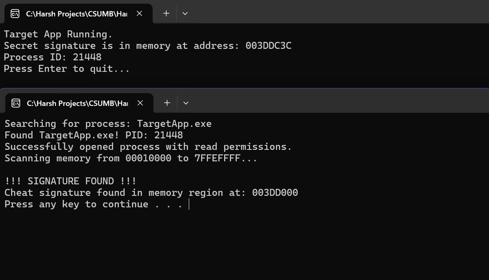

# C++ Process Memory Scanner

## Project Overview

This project is a C++ application for Windows that demonstrates a fundamental technique used in host-level security and anti-cheat systems: scanning the memory of another running process to find a specific "signature."

This project was built to demonstrate C++ proficiency and an understanding of Windows endpoint development and security concepts.

## Project Demo

Here is a screenshot of the `ProcessScanner.exe` successfully finding the hardcoded "cheat signature" inside the `TargetApp.exe` process's memory.



## Project Overview

This solution consists of two separate C++ console applications:

1.  **`TargetApp`:** A simple "target" program that, when run, loads a specific, volatile string signature (`LEVEL_99_CHEAT_CODE_12345`) into its own memory and waits.
2.  **`ProcessScanner`:** The main application. When run, it:
    * Scans the entire system for a process named `TargetApp.exe`.
    * Opens the `TargetApp` process with the necessary security permissions.
    * Iterates through all readable memory regions of the target.
    * Reads each memory region into a buffer.
    * Searches the buffer for the known `cheatSignature` string.
    * Reports whether the signature was found and at what memory address.

## How It Works: The Logic

The scanner uses several key functions from the Windows API to achieve this:

1.  **`EnumProcesses` (`Psapi.h`):** Gets a list of all running Process IDs (PIDs) on the system.
2.  **`OpenProcess` (`Windows.h`):** Attempts to get a "handle" (a reference) to a process using its PID. We request `PROCESS_QUERY_INFORMATION` (to read metadata) and `PROCESS_VM_READ` (to read its memory).
3.  **`GetProcessImageFileNameW` (`Psapi.h`):** Uses the process handle to get the file path of the executable (e.g., `C:\..._svchost.exe_`).
4.  **String Comparison (`_wcsicmp`):** Compares the executable name to our target (`TargetApp.exe`) in a case-insensitive way.
5.  **`VirtualQueryEx` (`Windows.h`):** Once the target is found, this function "walks" through its memory map, region by region. It returns a `MEMORY_BASIC_INFORMATION` struct that tells us the region's base address, size, and (most importantly) its state (`MEM_COMMIT`) and protection flags (`PAGE_READONLY`, `PAGE_READWRITE`, etc.).
6.  **`ReadProcessMemory` (`Windows.h`):** For each region that is committed and readable, this function copies the data from the target's memory into our scanner's local buffer.
7.  **`memcmp` (`string.h`):** A fast, byte-by-byte comparison to search our local buffer for the `cheatSignature` pattern.

## Tech Stack

* **C++:** Core application logic.
* **Windows API (Win32):**
    * `Windows.h`
    * `Psapi.h` (Process Status API)
* **Visual Studio 2022:** C++ Console App projects and solution.
* **Git:** Version control.

## How to Build and Run

1.  **Clone the repository:**
    ```bash
    git clone <YOUR_GITHUB_REPO_URL.git>
    cd WindowsProcessScanner
    ```
2.  **Open the Solution:**
    * Open the `ProcessScannerSolution.sln` file in Visual Studio 2022.
3.  **Build the Solution:**
    * In the top menu, go to **Build -> Build Solution**. This will compile both `TargetApp.exe` and `ProcessScanner.exe`.
4.  **Run `TargetApp.exe`:**
    * Navigate to the build output directory. This will likely be `x64/Debug/` (or `Win32/Debug/` depending on your settings).
    * Double-click `TargetApp.exe` to run it.
    * A console window will appear. **Leave this window open.**
5.  **Run `ProcessScanner.exe`:**
    * In the *same* `Debug` folder, double-click `ProcessScanner.exe`.
    * A second console window will open, scan for the target, and report its findings.
    * **(Alternatively):** To run the scanner in the Visual Studio debugger, right-click the `ProcessScanner` project in the Solution Explorer, select **"Set as Startup Project"**, and press the green "▶" button.
